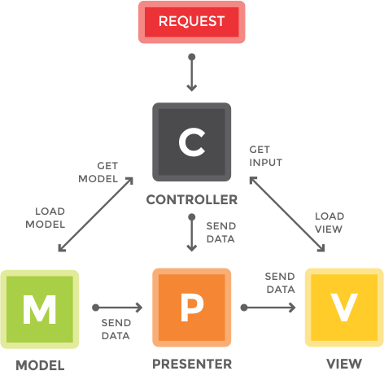
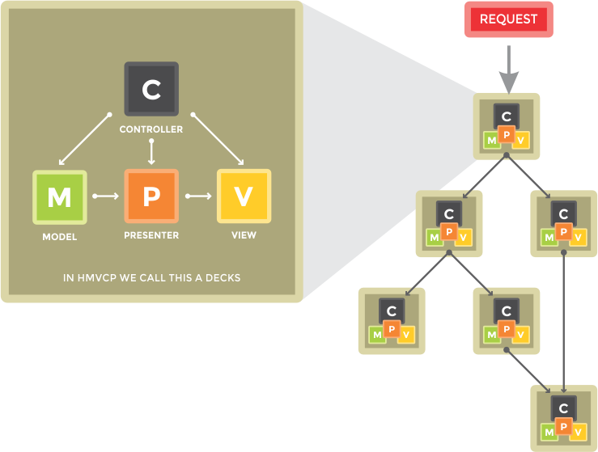

Sistem arsitektur adalah sebuah model konseptual yang mendefinisikan struktur dan alur dari sebuah sistem. Representasi dari sebuah sistem terkandung dari arsitektur pemetaan hubungan antara satu komp

## Dependency Libraries

Pada dasarnya O2System Framework merupakan pemersatu dari keseluruhan library-library yang dibuat bergantung sepenuhnya pada O2System Kernel. Sedangkan O2System Kernel itu sendiri bergantung pada 3 library dasar yaitu:

- O2System Psr (PHP Standard Recommendation)
- O2System Spl (Standard PHP Library)
- O2System Gear (Developer Tools)

Untuk lebih jelasnya anda dapat membacanya di bagian Dasar dari O2System Framework.

Daftar library-library dasar ini merupakan bagian dari fondasi dari O2System Framework:

- O2System Kernel
- O2System Filesystem
- O2System Cache
- O2System Database
- O2System Html
- O2System Parser
- O2System Image
- O2System Security
- O2System Curl
- O2System Email

## Model-View-Controller-Presenter (MVCP)

O2System Framework mengimplementasikan arsitektur Model-View-Controller (MVC), yang sudah sangat populer dipergunakan dalam berbagai php framework lainnya. MVC adalah sebuah metode untuk memisahkan data (Model) dari tampilan (View) dan bagaimana cara memprosesnya (Controller). Lalu apa yang dimaksud dengan Presenter, Presenter merupakan sebuah metode untuk memisahkan logical-view dari tampilan (View). Didalam O2System Framework arsitektur MVC kini telah berkembang menjadi arsitektur MVCP.

Dalam O2System Framework presenter dibuat sebagai Item Storage design pattern class dan hanya terdapat ketika aplikasi diakses dengan menggunakan browser atau dengan kata lain hanya aktif dalam mode HTTP Request. Presenter berfungsi sebagai pengolahan data aplikasi yang didapat dari user-input, web-service atau database. Kemudian diolah tampilan logikanya pada Presenter untuk ditampilkan dalam tampilan (View).

## Hierarchical Model-View-Controller-Presenter (HMVCP)

HMVCP adalah evolusi dari arsitektur Model-View-Controller-Presenter (MVCP) seperti yang dijelaskan diatas untuk menyelesaikan banyak masalah skalabilitas. Sesuai dengan yang diterbitkan pada situs web JavaWorld, Juli 2000, mengusulkan agar standar tiga serangkai Model, View, dan Controller yang penerapannya dalam O2System Framework diperlengapi dengan keberadaan Presenter dilapisi menjadi "hierarchy of parent-child MCVP layers". Gambar di bawah menggambarkan bagaimana ini bekerja:

HMVCP adalah koleksi dari decks MVCP yang dapat beroperasi sebagai satu mini aplikasi. Setiap MVCP decks benar-benar independen dan dapat dieksekusi tanpa kehadiran MVCP decks lainnya. Semua permintaan yang dibuat untuk MVCP decks harus melalui controller.

Modularisasi 
: Penerapan arsitektur HMVCP secara tidak langsung menjadikan struktur aplikasi menjadi modular.

Terorganisir 
: Memiliki direktori untuk masing-masing HMVCP decks yang relevan membuat beban kerja sistem menjadi lebih ringan.

Dapat Digunakan Kembali (Reusable) 
: Menerapkan arsitektur HMVCP membuat kode-kode source code dari masing-masing HMVCP decks dapat digunakan kembali diproyek-proyek aplikasi lainnya.

Mudah Dirawat 
: Membuat aplikasi menjadi lebih mudah untuk dirawat tanpa harus mengganggu HMVCP decks lainnya.

Mudah Diperluas 
: Membuat aplikasi menjadi lebih mudah untuk diperluas tanpa mengorbankan kemudahan perawatannya.

Keuntungan ini akan memungkinkan anda untuk melakukan explorasi lebih dalam pengembangan aplikasi anda dengan sedikit sakit kepala.

## Modular HMVCP

Modular HMVCP adalah evolusi dari arsitektur Hierarchical Model-View-Controller-Presenter (HMVCP). HMVCP itu sendiri bisa dibilang merupakan sebuah modul berdasarkan strukturnya. Namun arsitektur modular HMVCP dibuat untuk menyempurnakannya.

Modular HMVCP adalah sebuah paket yang didalamnya terdiri dari banyak HMVCP decks. Arsitektur Modular HMVCP ini hanya terdapat pada O2System Framework dan secara default terbagi dalam lima (5) jenis tipe modular:

Apps 
: Apps merupakan jenis paket yang dapat disebut sebagai aplikasi karena terdiri dari kumpulan paket-paket yang akan dijelaskan pada point-point selanjutnya.

Modules 
: Modules merupakan jenis paket standar yang dipergunakan sebagai front-office modular system. Namun tidak terbatas untuk dipergunakan sebagai back-office modular system.

Components 
: Components merupakan jenis paket standar yang dipergunakan sebagai back-office modular system.

Plugins 
: Plugins merupakan jenis paket standar yang dipergunakan sebagai add-ons functionality pada tipe paket-paket diatas.

Widgets 
: Widgets merupakan jenis paket standar yang dipergunakan sebagai add-ons tampilan pada modular system. Berbeda dengan jenis plugins widgets tidak memiliki controller sehingga membuatnya tidak dapat diakses secara langsung.

Kehebatan arsitektur HMVCP dari O2System Framework tidak berakhir di sini, Anda dapat membuat tipe modular Anda sendiri di dalam dengan namespace yang dapat Anda tentukan sendiri.

## Search Engine and Human Friendly URL

Arsitektur URL yang diterapkan di O2System Framework sangat clean dan dirancang untuk search-engine dan human friendly, jauh lebih baik daripada menggunakan "query string". Bagi para developer yang sudah mulai menggunakan php framework tentunya sudah tidak asing lagi dengan arsitektur Uniform Resource Identifier (URI) berdasarkan segmentasi, yang sering disebut juga dengan istilah URI Segments.

Ada 5 arsitektur URI Segments dasar di O2System Framework:

1. Common URI Segments 
: URI Segments ini merupakan arsitektur umum yang dipergunakan sebagai dasar dari pengembangan URI Segments lainnya.
`http://example.com/controller/method/param`

2. Pages URI Segments 
: URI Segments ini merupakan arsitektur tambahan yang dipergunakan untuk mengakses halaman statis.
`http://example.com/page-name`

3. Language URI Segments   
URI Segments ini merupakan arsitektur tambahan yang menghasilkan dampak yang berbeda pada sistem bila diakses.

    - Language on Common URI Segments  
    : Segment language akan otomatis mengubah default bahasa pada sistem sesuai dengan permintaan pada language URI segment.
    `http://example.com/en-US/controller/method/param`

    - Language on Pages URI Segments  
    : Segment language akan otomatis mengubah default bahasa pada sistem sesuai permintaan pada language URI segment dan sekaligus mengarahkan direktori bahasa yang terdapat pada direktori Pages.
`http://example.com/en-US/page-name`

4. Directory URI Segments  
: URI Segments ini merupakan arsitektur tambahan yang dipergunakan untuk mengakses controller atau halaman statis dalam direktori.

    - Directory Common URI Segments  
    `http://example.com/directory-name/controller/method/param`

    - Directory Pages URI Segments  
    `http://example.com/directory-name/page-name`

5. Modular URI Segments 
URI Segments ini merupakan arsitektur tambahan untuk mendukung sistem modular yang dipergunakan untuk mengakses keempat jenis arsitektur diatas yang terdapat pada salah satu module.

    - Modular Common URI Segments  
    `http://example.com/module-name/controller/method/param`

    - Modular Directory Common URI Segments  `http://example.com/module-name/directory-name/controller/method/param`

    - Language on Common URI Segments  `http://example.com/en-US/module-name/controller/method/param`

    - Modular Pages URI Segments  
    `http://example.com/module-name/page-name`

    - Modular Directory Pages URI Segments  `http://example.com/module-name/directory-name/page-name`

    - Language on Pages URI Segments  
    `http://example.com/en-US/module-name/page-name`

Untuk menambahkan URI Suffix secara otomatis, anda dapat melakukannya dengan mengedit file app/Config/Config.php pada line 154: 
`$config[ 'uri' ][ 'suffix' ] = '.html';`